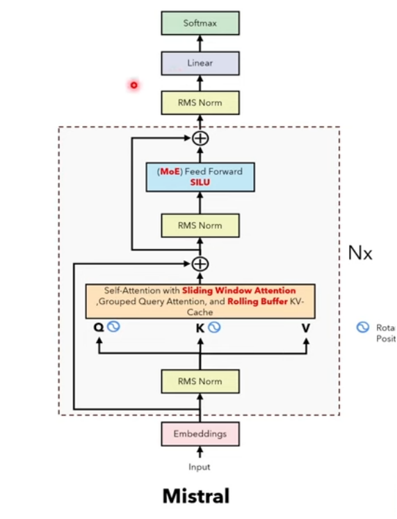
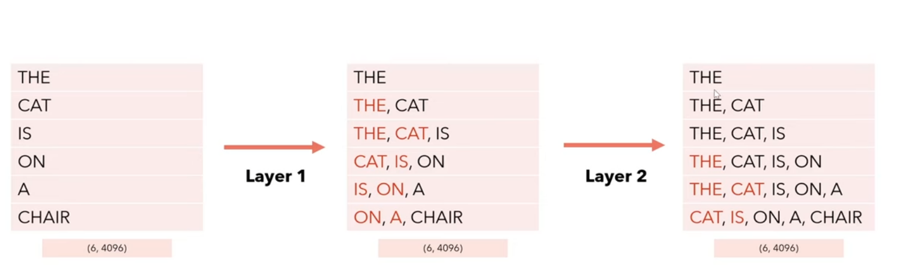
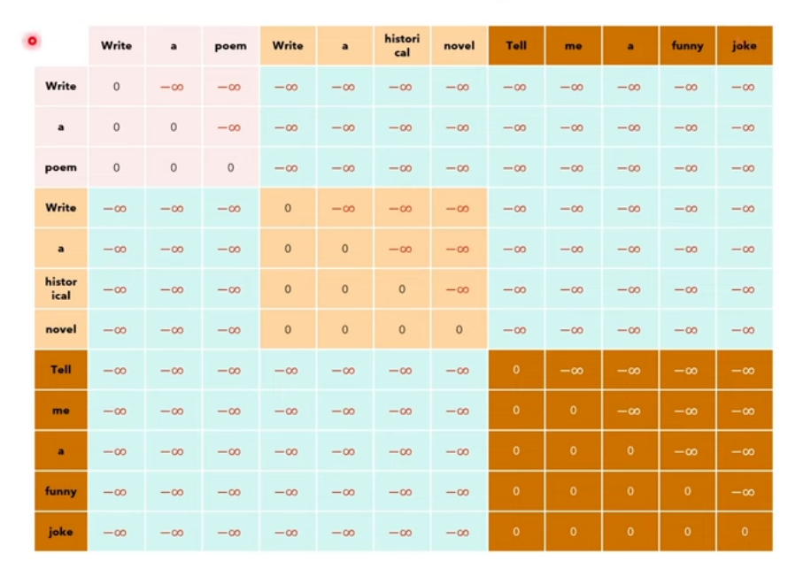

# Mistral 

<p align="center">
  
</p>

Key innovations:
- Sliding Window Attention
    - reduces the number of dot products to perform and thus performance during training and inference
    - focuses on local context is enoguh for most cases
    - it still allows one token to attend to tokens outside the window using **receptive field** in CNN
    - After passing to a layer, each embedding at each token will have encoded information about the previosu W tokens already
    - so passing it to another layer will extend the amount of tokens that embedding will attend to
<p align="center">
  
</p>

- Rolling buffer Cache
    - Combines the idea of KV Cache some properities of the Sliding Window Attention
    - Because each token embedding will contain information about its previous W tokens it is not necessary to keep all L tokens in the K and V cache
    - You just need to keep the latest W tokens in the cache 
    - we use a write pointer to keep track of where you are in the cache
```python
#Case 1: cache is not filled
[   THE  ,  CAT  ,   -   ,   -   ]
             |
             p
#Then take everything up to pointer

#Case 2: cache is not filled
[   THE  ,  CAT  ,   IS   ,   ON   ]
                               |
                               p
#Then take everything up to pointer or end of cache

#Case 3: cache is starting to get overwritten as we go beyong window size
[   A  ,  CAT  ,   IS   ,   ON   ]
     |
     p
#Then we do an unrolling, rotate the cache around the pointer such that the order of tokens is linear and correct

def unroll(cache:torch.Tensor,seq_len:int):
    assert cache.ndim == 3 #cache should have shape (W,H,D) W is window size
    pointer = seq_len % cache.shape[0]
    if seq_len < cache.shape[0]: # means that cache is not filled
        return cache[:seq_len]
    elif seq_len == cache.shape[0]:# just reached the full cache length, just return the entire cache
        return cache
    elif seq_len > cache.shape[0]: #went over the cache, wrapped around
        return torch.cat([cache[pointer:],cache[:pointer]],dim=0)    


```

- Pre-fill and chunking
    - chunking the prompt into chunks of W tokens
    - current chunk is the Query
    - In prefilling stage (meaning its the first chunk), K and V cache have just 1 chunk
    - After processing that chunk, we receive a new chunk of tokens
    - K and V get updated by adding previous chunk with new chunk (tokens of the previous chunk)
    - Q gets replaced with the new chunk
    - this goes on until the entire prompt is processed

- Mixture of Experts (MoE)
    - we use a gating mechanism to select which expert to use
    - the weighted sum happens at the feedforward layer, we have 8 experts in Mistral
    - apply softmax after selecting the top k experts

- Pipeline parallelism
    - splits the model across different GPUs
    - each GPU deals with a microbatch at each timestep

- xformers block attention 
    - we create a batch of different token sequences to process multiple prompts at once
    - we add padding such that each sequence has the same length
    - create a causal mask, we use the same mask for all token sequences within the batch
    - Solution:
        - keep track of how long each prompt is
        - then put all prompts together into one sequence
        - we need to create a block diagonal causal mask

<p align="center">
  
</p>

## RoPE
- Link to really good article explaining this: https://medium.com/@ngiengkianyew/understanding-rotary-positional-encoding-40635a4d078e
- RoPE is a positional encoding method, it **combines** absolute and relative positional encoding methods
- Why is it bad to use absolute positional encoding
    -  absolute positional encoding does not capture the positional information for the entire sequence
    - there is no relationship btw positions
    - relative distances are inconsistent
    - E.g. `[0.1,0.01,0.5]` leads to `dist_btw_0_and_2` $>>>$ `dist_btw_0_and_1`, which doesnt make sense cuz token at pos 2 shd be further
- Why is it bad to use relative positional encoding
    - 